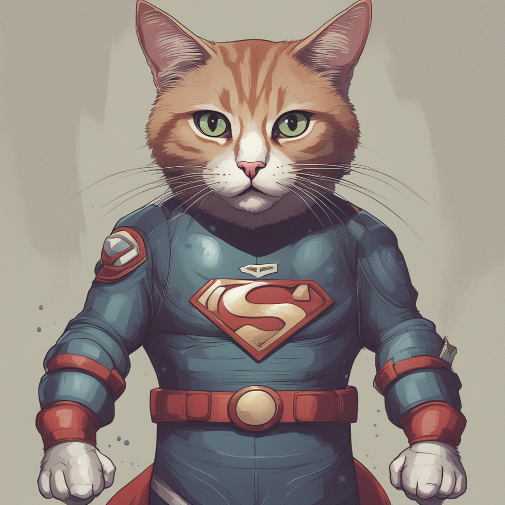

# Stable Diffusion XL ( API )

This is a Node.js module that allows you to generate images using the Replicate API. This module is based on a Python version originally created by [KoushikNavuluri](https://github.com/KoushikNavuluri/stable-diffusion-xl-api) and adapted to Node.js by [Rivs](https://github.com/rivaldodev).

## Credits to the Original Creator

This module is an adaptation of an original Python version created by [KoushikNavuluri](https://github.com/KoushikNavuluri/stable-diffusion-xl-api). I would like to thank the original creator for providing the original Python version.

## Description

This module provides a simple way to generate images using the Replicate API. It includes a `genImage` function that accepts parameters such as prompt, width, height, among others. Additionally, the `negativePrompt` parameter has been added to allow the inclusion of negative prompts in image generation.

## Installation

To use this module in your Node.js project, you can install it via npm. Run the following command:

```bash
npm install stdxl
```

## Usage

Here's an example of how to use the genImage function:

```javascript
const imageGenerator = require('stdxl');

async function generateImage() {
  const prompt = "Super hero Cat";
  const negativePrompt = "Super hero cape";
  const image = await imageGenerator.genImage(prompt, negativePrompt);
  console.log(image);
}

generateImage();
```


### Output




### List of parameters

      *   prompt = Input text prompt
      *   negative_prompt = Input text negative prompt
      *   width  = Width of output image(max:1024)
      *   height = height of output image(max:1024)
      *   count  = Number of images to output. (minimum: 1; maximum: 4) 
      *   refine = Which refine style to use ( no_refiner or expert_ensemble_refiner or base_image_refiner )
      *   scheduler = scheduler (valid_schedulers = ["DDIM" or "DPMSolverMultistep" or "HeunDiscrete" or "KarrasDPM" or "K_EULER_ANCESTRAL" or "K_EULER" or "PNDM"])
      *   guidance_scale = Scale for classifier-free guidance (minimum: 1; maximum: 50) 
      *   prompt_strength = Prompt strength in image (maximum: 1) 
      *   num_inference_steps = Number of denoising steps (minimum: 1; maximum: 500) 
      *   high_noise_frac = for expert_ensemble_refiner, the fraction of noise to use (maximum: 1)